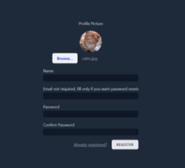

# 🖼 Freedom Wall / Messenger-Style Web App

A Laravel + Tailwind CSS web app that lets people post anonymous messages, reply to others, and customize message colors.  
Think of it like a **Facebook Messenger-style wall**, but open and fun.

---

## 🚀 Features

✅ **Post Messages** – Anyone can share their thoughts anonymously  
✅ **Replies** – Reply to any message in a chat-like thread  
✅ **Colorful UI** – Each message/reply has its own color theme  
✅ **Modal-Based Replies** – Replies open in a smooth pop-up modal  
✅ **Responsive Design** – Works on desktop and mobile  

---

## 🛠 Tech Stack

- **Laravel** – Backend framework
- **Blade** – Templating engine
- **Tailwind CSS** – Styling
- **SQLite** – (Optional) Lightweight database for development

---

## 📸 Screenshots

| Feature | Preview |
|--------|---------|
| **Message Wall** |  |
| **Reply Modal** |  |
| **Message Modal** |  |
| **Responsive Layout** |  |
| **Account Creation** |  |
| **Account Login** |  |
| **Account Edit** |  |

---

